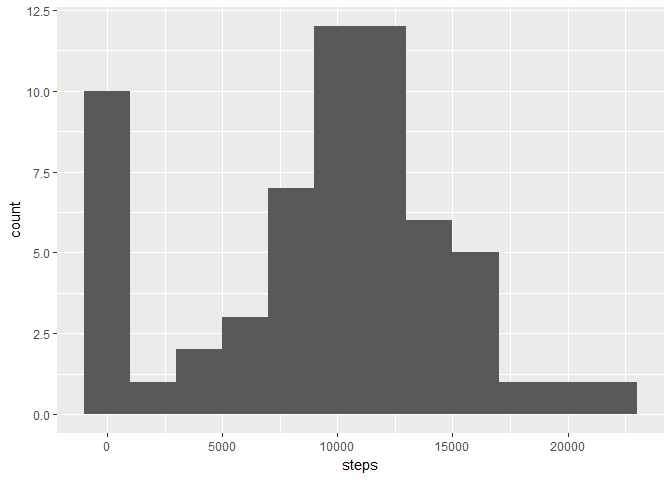
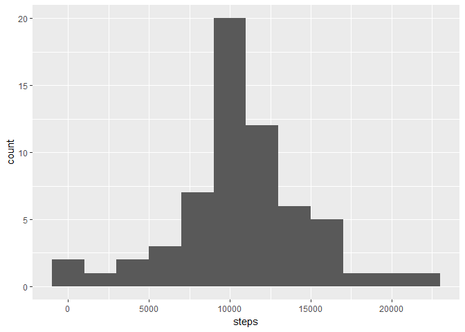

# Reproducible Research: Peer Assessment 1


## Loading and preprocessing the data


```r
library(dplyr)
library(lubridate)
```

* Load the data with 'read.csv'
* The file "activity.csv" must be in your working directory


```r
activity <- read.csv("activity.csv")
activity <- activity %>%
        tbl_df %>%
        mutate(date = ymd(date))
```

## What is mean total number of steps taken per day?
First, we show a histogram of the numer of steps taken per day, ignoring missing values.


```r
library(ggplot2)

activity_by_day <- activity %>% 
        group_by(date) %>% 
        summarize(steps = sum(steps, na.rm = TRUE))

hist1 <- ggplot(activity_by_day, aes(x = steps))

hist1 + geom_histogram(binwidth = 2000)
```

<!-- -->

We calculate the mean and median number of steps per day, again ignoring missing values.


```r
mean(activity_by_day$steps)
```

```
## [1] 9354.23
```


```r
median(activity_by_day$steps)
```

```
## [1] 10395
```

## What is the average daily activity pattern?
We now find the average number of steps per time interval over all recorded days, and plot a time series with this data.


```r
activity_by_interval <- activity %>% 
        group_by(interval) %>% 
        summarize(steps = mean(steps, na.rm = TRUE))

timeSeries1 <- ggplot(activity_by_interval, aes(x = interval, y = steps))

timeSeries1 + geom_line()
```

<!-- -->

We find the interval with the greatest number of steps on average.


```r
with(activity_by_interval, interval[which.max(steps)])
```

```
## [1] 835
```

## Imputing missing values

The presence of missing days may introduce bias into some calculations or summaries of the data. We compute the number of missing values in our data frame.


```r
sum(is.na(activity$steps))
```

```
## [1] 2304
```

We replace missing values with the average number of steps for that time interval.


```r
imputed_activity <- activity %>%
        group_by(interval) %>%
        mutate(avg_interval_steps = mean(steps, na.rm = TRUE)) %>%
        mutate(steps = ifelse(is.na(steps), avg_interval_steps, steps)) %>%
        select(-avg_interval_steps) %>%
        ungroup
```

We plot a histogram of the new data with the imputed missing values.


```r
imputed_activity_by_day <- imputed_activity %>% 
        group_by(date) %>% 
        summarize(steps = sum(steps))

hist2 <- ggplot(imputed_activity_by_day, aes(x = steps))

hist2 + geom_histogram(binwidth = 2000)
```

<!-- -->

We calculate the mean and median number of steps per day with the imputed missing values.


```r
mean(imputed_activity_by_day$steps)
```

```
## [1] 10766.19
```


```r
median(imputed_activity_by_day$steps)
```

```
## [1] 10766.19
```

We notice that these numbers are greater than our previous estimates for mean and median number of steps per day. So imputing the missing data in the way we did increases our estimates. 

## Are there differences in activity patterns between weekdays and weekends?

Defining the weekend as Saturday and Sunday, we examine the mean for each time interval, averaged across all weekend days or all weekdays as appropriate


```r
weekend_days <- c("Saturday", "Sunday")

weekend_data <- imputed_activity %>% 
        mutate(dayend = factor(ifelse(weekdays(date) %in% weekend_days, "Weekend", "Weekday"))) %>%
        group_by(dayend, interval) %>% 
        summarize(steps = mean(steps))
```

We plot the time series of average steps taken over each five-minute time interval for weekends and for weekdays.


```r
timeSeries2 <- ggplot(weekend_data, aes(x = interval, y = steps))

timeSeries2 + geom_line() + facet_grid(dayend~.)
```

<!-- -->
